<h1 align="center">Personal Storage</h1>

<p align="center">
  <b>Zero-friction, local-first knowledge capture</b> with an on-device "neural brain" and an interactive knowledge graph.<br/>
  Think a thought → it is saved, categorised, tagged, scheduled and connected — before you look away.
</p>

<p align="center">
  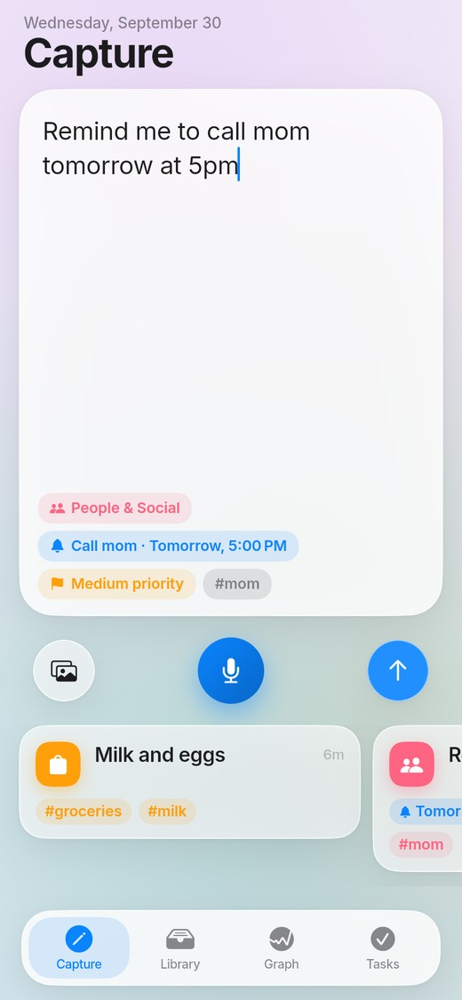
  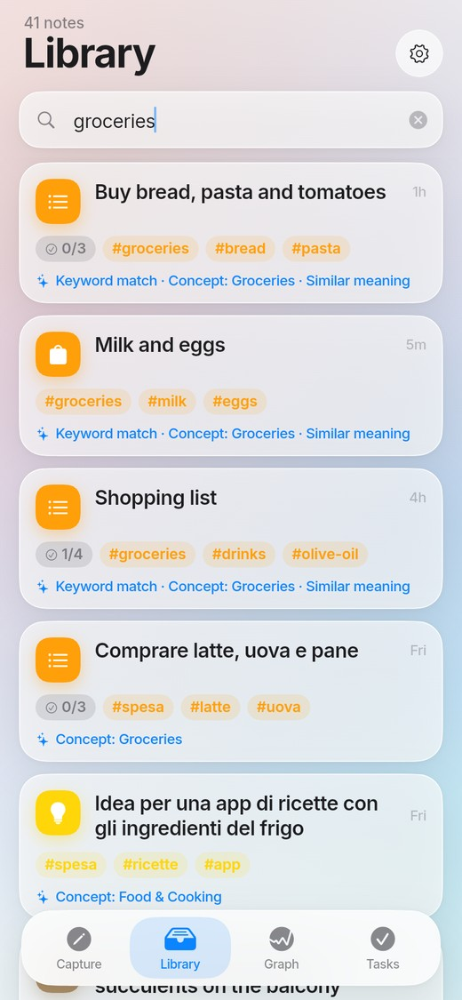
  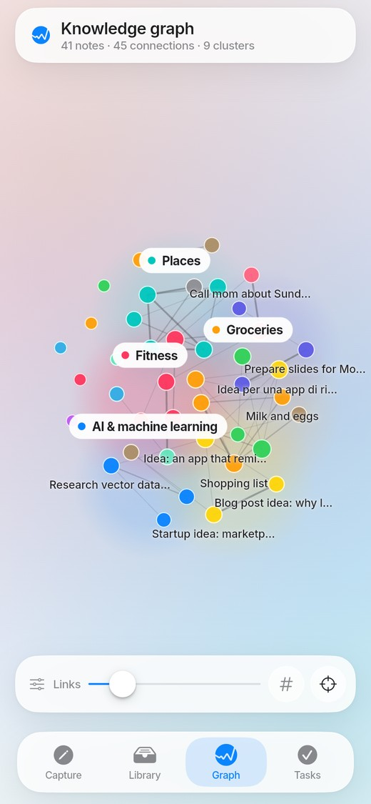
  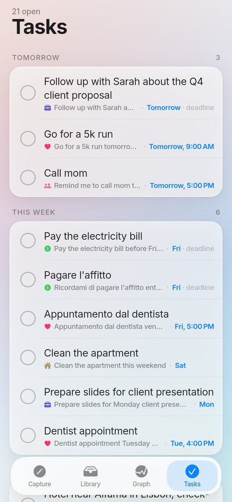
</p>

---

## What it does

| You | The app |
|---|---|
| Open it | The composer is already focused. Type, or tap the mic. No folders, no titles, no tagging. |
| Write *"Remind me to call mom tomorrow at 5pm"* | Creates the task **Call mom** with a deadline and a local reminder, files the note under *People*, tags `#mom` — the chips appear live while you type. |
| Write *"milk and eggs"* | Tags it `#groceries`, files it under *Shopping*, offers **Make checklist**. |
| Search *"groceries"* | Finds *milk and eggs* (and the Italian *Comprare latte, uova e pane*) **by meaning**, and tells you why it matched. |
| Open the Graph | Every note is a node, related ideas are connected by the AI and grouped in clusters; pinch, pan, drag nodes, tap to open. |

> English and Italian are understood natively (dates, reminders, vocabulary). The UI is English.

## Requirements → where they live

| Requirement | Implementation |
|---|---|
| **Opens on an active input; one-tap capture from the lock screen** | Autofocused composer + resume-to-capture (`capture_screen.dart`). Deep links `personalstorage:///capture` / `///voice` fired by the **Android Quick Settings tile, widget (home + keyguard), shortcuts**, **iOS lock-screen widgets and iOS 18 controls** ([docs](docs/NATIVE_INTEGRATIONS.md)). |
| **Plain text, formatted checklists, image collages, web links** | Note kinds `text / checklist / link / image`; auto-detected or suggested checklists; `PhotoCollage` (1–N photos); link cards with fetched title/description. |
| **Voice-to-text, local or cloud, categorised** | `speech_to_text` with *Prefer on-device*; the dictated text goes through the same pipeline and is saved automatically (configurable). |
| **NLP: tags, categories, priority — no manual tagging** | 67-concept bilingual ontology + static embeddings; category, tags and an explainable priority for every note ([AI engine](docs/AI_ENGINE.md)). |
| **Semantic search by meaning** | Hybrid neural + concept + FTS5 index with "why matched" chips. |
| **Action extraction → tasks with deadlines** | EN/IT date parser and action extractor; Tasks tab grouped by due date; local reminders (survive reboot on Android). |
| **Obsidian-style force-directed graph, AI edges, pinch/pan, tap to open** | Barnes–Hut layout on typed arrays, label collision avoidance, clusters, node dragging ([graph](docs/GRAPH.md)). |
| **macOS/Cupertino glass UI, 60 fps micro-animations** | Translucent blur surfaces, squircles, Inter, springs, dark mode ([design system](docs/DESIGN_SYSTEM.md)). Repaint-only graph animation with a 1.1 ms layout tick. |
| **Local-first, offline, performant** | SQLite (drift) + bundled 7.9 MB model; no server, no account. Write-first/enrich-after capture ([architecture](docs/ARCHITECTURE.md)). |
| **Pushed to GitHub with docs** | This repository: code, assets, tests, CI, ADRs. |

## Screenshots

Captured from the web build in headless Chromium by `tool/web_shots.py` (the same flows the tests drive).

<table>
<tr>
<td align="center"><br/><sub>Live insights while typing</sub></td>
<td align="center">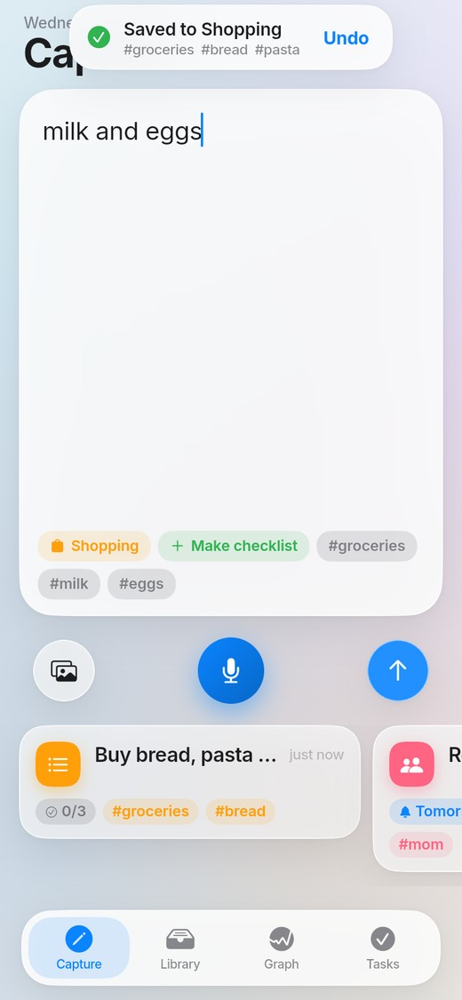<br/><sub>"milk and eggs" → tags + checklist suggestion</sub></td>
<td align="center">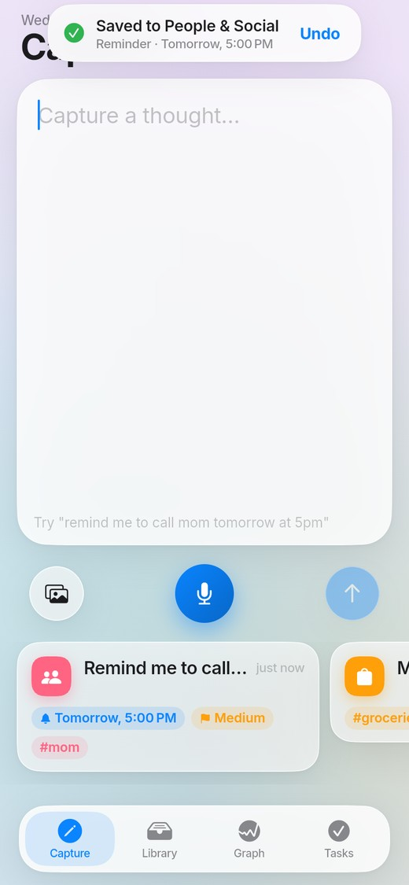<br/><sub>Saved toast with Undo, recent captures</sub></td>
<td align="center">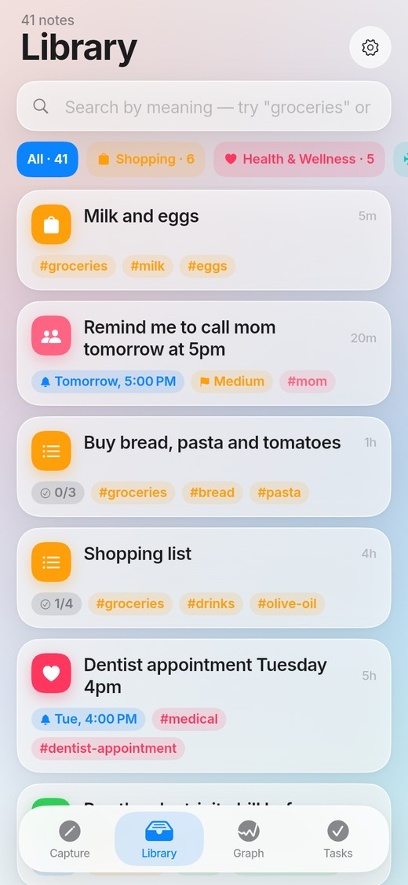<br/><sub>Library with category filters</sub></td>
</tr>
<tr>
<td align="center"><br/><sub>Search by meaning, with reasons</sub></td>
<td align="center">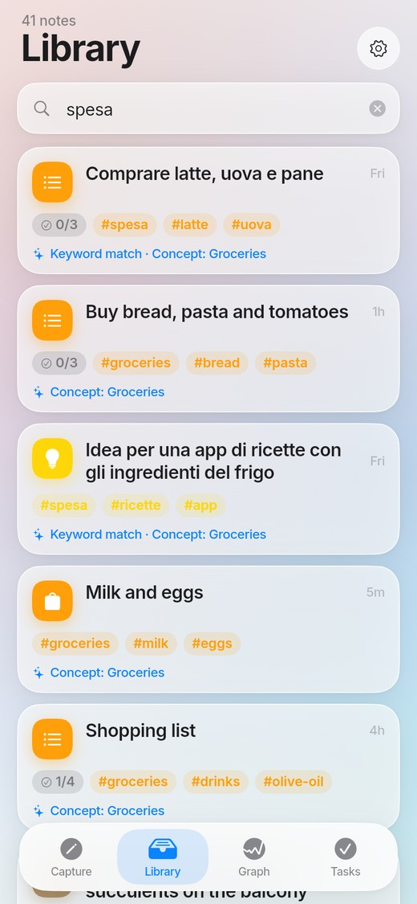<br/><sub>Italian query, English notes</sub></td>
<td align="center">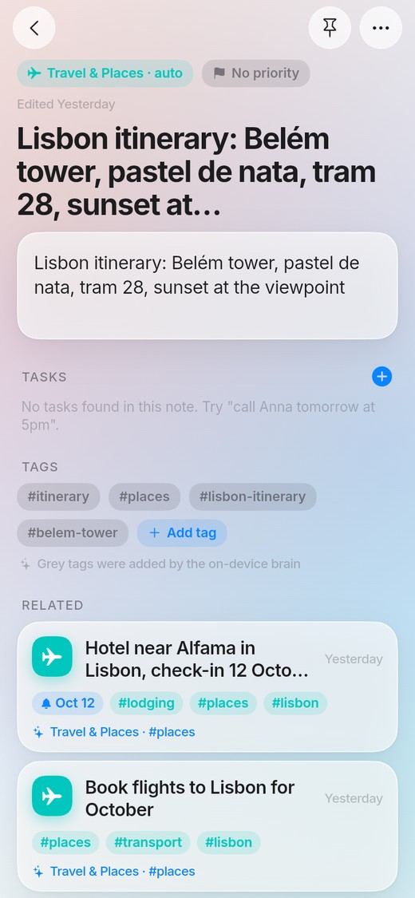<br/><sub>Note detail: category, tags, related</sub></td>
<td align="center"><br/><sub>Tasks extracted from notes</sub></td>
</tr>
<tr>
<td align="center"><br/><sub>Knowledge graph, clusters</sub></td>
<td align="center">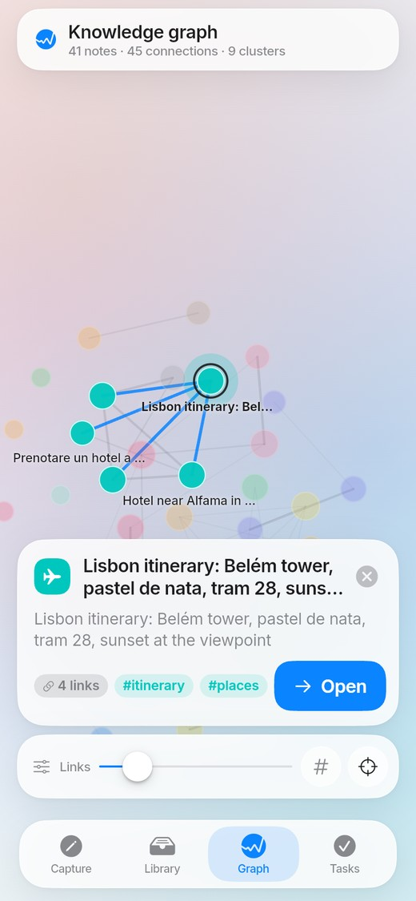<br/><sub>Selected node, neighbourhood lit</sub></td>
<td align="center">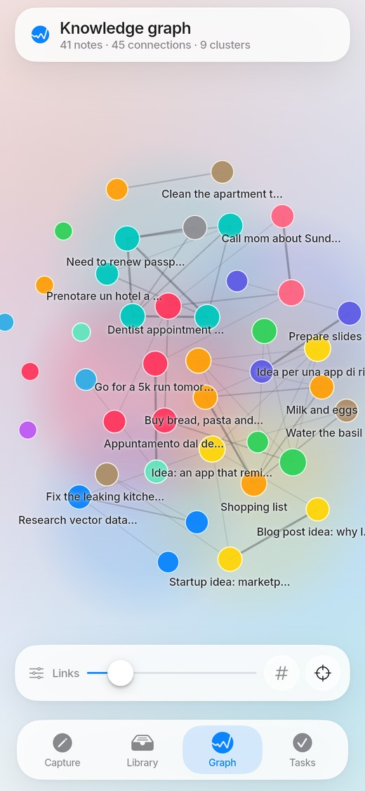<br/><sub>Zoomed: collision-free labels</sub></td>
<td align="center">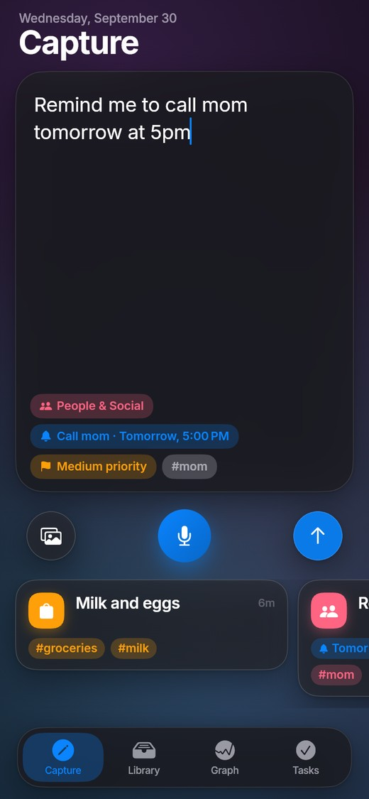<br/><sub>Dark mode</sub></td>
</tr>
<tr>
<td align="center">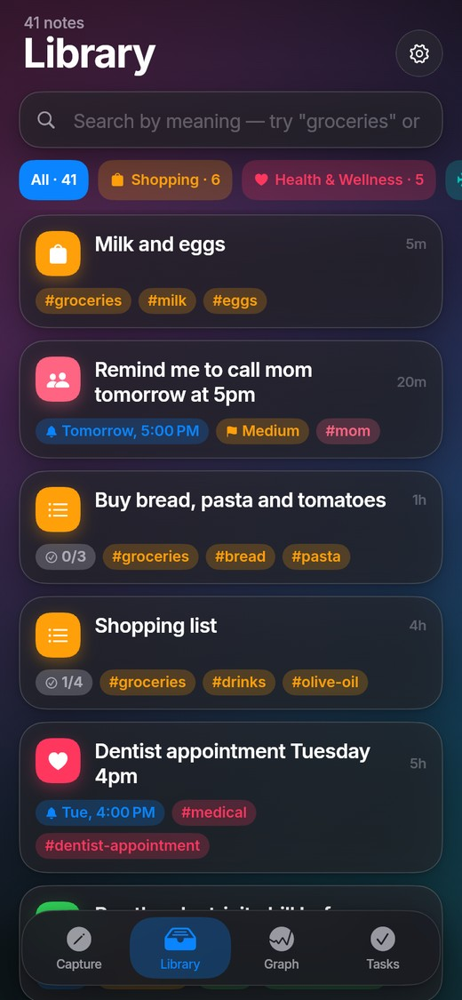<br/><sub>Library, dark</sub></td>
<td align="center">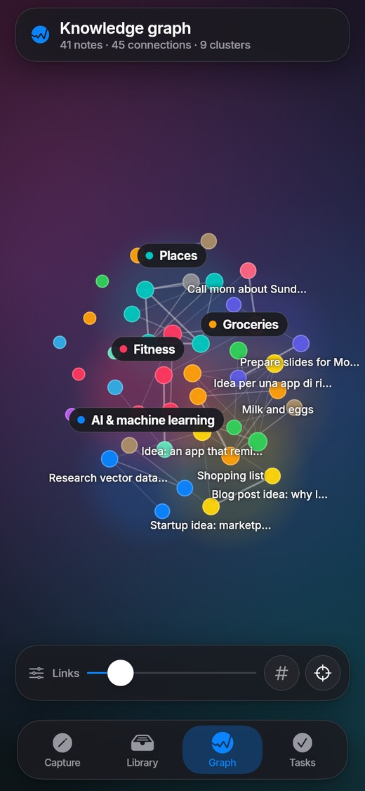<br/><sub>Graph, dark</sub></td>
<td align="center">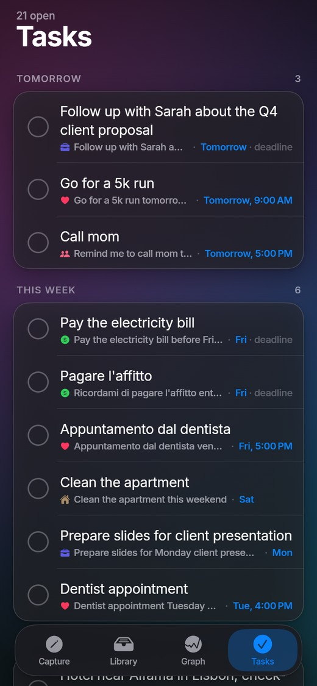<br/><sub>Tasks, dark</sub></td>
<td align="center">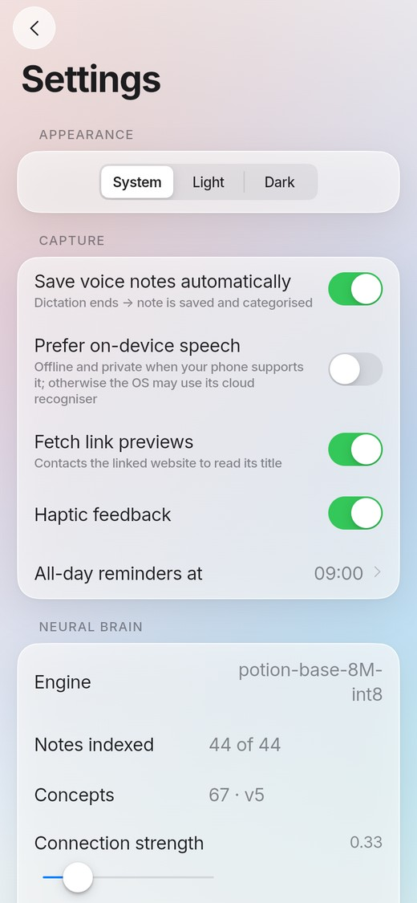<br/><sub>Settings, incl. optional cloud embeddings</sub></td>
</tr>
</table>

## Architecture at a glance

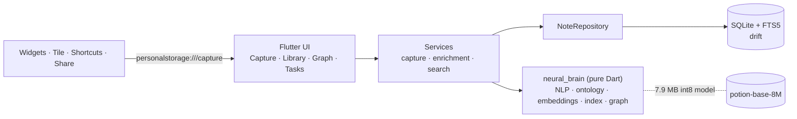

Capture is **write-first, enrich-after**: one local transaction makes the note safe and searchable in ~10 ms;
reminders, graph edges and link previews follow on a background queue. Details and sequence diagrams:
[docs/ARCHITECTURE.md](docs/ARCHITECTURE.md).

## Getting started

```bash
# Flutter 3.47.x / Dart 3.13 (CI pins the exact version)
flutter pub get
(cd packages/neural_brain && dart pub get)
flutter run                       # device or simulator
flutter run -d chrome             # web demo (SQLite via WASM)
flutter test                      # 73 app tests
(cd packages/neural_brain && dart test)   # 147 brain tests
```

Android needs JDK 17+ and the Android SDK; iOS needs Xcode. Generated code (`*.g.dart`) is committed; run
`dart run build_runner build` only after changing `lib/data/db/tables.dart`. The iOS widget extension is opt-in:
`ruby tool/ios/add_widget_extension.rb` (see [native integrations](docs/NATIVE_INTEGRATIONS.md)).
First-time Android builds download Gradle, the NDK and dependencies (≈8 min).

## Project layout

```
lib/
  app/        shell, routing (deep links), Riverpod providers
  core/       design system (tokens, glass, widgets), utilities
  data/       drift schema + NoteRepository (the only SQL)
  domain/     plain models
  features/   capture · library · note · graph · tasks · settings
  services/   capture, enrichment queue, search, graph, reminders, voice, link previews
packages/neural_brain/   pure-Dart NLP, ontology, embeddings, hybrid index, graph + force layout
android/ ios/ web/       native entry points (tile, widget, shortcuts, share, WidgetKit sources)
assets/                  on-device model (.psm), Inter font, app icon master
tool/                    model converter, icon generator, screenshot harness, iOS extension script
docs/                    architecture, AI engine, graph, design system, native, privacy, ADRs
```

## Measured performance

Dart VM in a 2-vCPU Linux sandbox (JIT) — not a phone.

| Operation | Result |
|---|---|
| Encode a sentence | 27–37 µs |
| Analyse a note (language, dates, tasks, priority, concepts, tags) | ≈ 1 ms |
| `capture()` end to end, in-memory DB | ≈ 10 ms |
| Semantic search over 5,000 notes | 3–4 ms |
| Force-layout tick, 1,000 nodes / 2,000 edges | ≈ 1.1 ms (frame budget 16 ms) |
| Brain cold start (decode model + index + 67 centroids) | ≈ 40 ms warm / 160 ms first run |

## Verification status

Everything below was actually run, except where marked otherwise.

| Area | Status |
|---|---|
| `neural_brain`: 147 tests incl. **token-id parity with the Python Model2Vec reference** and quality gates | ✅ passing |
| App: 73 tests — real SQLite/FTS5 + real model; widget flows (capture → chips → save → undo, search, tasks, detail, settings, deep links incl. cold start), graph controller/painter, design system incl. 2.4× text | ✅ passing |
| Web build driven end-to-end in headless Chromium through accessibility labels (screenshots above) | ✅ done |
| Android `flutter build apk --debug`; merged manifest inspected (tile, widget, shortcuts, share/deep-link filters, receivers, permissions) | ✅ builds |
| iOS Info.plist changes; `add_widget_extension.rb` run against the real project file (idempotent, well-formed) | ✅ checked |
| Category accuracy on unseen notes | ≈ 80–85 % (first-run 82 % on a fresh 28-note set; see [AI engine](docs/AI_ENGINE.md#accuracy-measured-and-how-to-read-it)) |
| Android tile / widget / share / reminders **on a device or emulator** | ⚠️ not verified (no emulator available) |
| **Anything iOS at runtime**, incl. compiling the Swift widget extension | ⚠️ not verified (no Xcode) |
| Real dictation, camera/photo picker, notification delivery | ⚠️ not verified on hardware (platform plugins; the no-speech-engine path is tested) |
| 60 fps on a physical phone | ⚠️ not profiled; the design targets it (repaint-only animation, 1.1 ms layout tick) |
| GitHub Actions workflow | ⚠️ syntax-validated; see the Actions tab for its first real run |

## Privacy

Nothing leaves the device unless you turn it on: link previews (HTTP GET to the saved URL, toggle), optional
cloud embeddings (off by default), and the OS speech recogniser. No analytics, no accounts.
See [docs/PRIVACY.md](docs/PRIVACY.md).

## Roadmap

Sync (IDs/tombstones are ready), Italian UI localisation, on-device Whisper transcription, widgets that save text
without opening the app (App Intents / App Group inbox), wikilink edges UI, ontology editor, desktop layout.

## Documentation

[Architecture](docs/ARCHITECTURE.md) · [AI engine](docs/AI_ENGINE.md) · [Knowledge graph](docs/GRAPH.md) ·
[Design system](docs/DESIGN_SYSTEM.md) · [Native integrations](docs/NATIVE_INTEGRATIONS.md) ·
[Privacy](docs/PRIVACY.md) · [ADRs](docs/adr) · [Third-party notices](docs/THIRD_PARTY.md) ·
[Contributing](CONTRIBUTING.md) · [Changelog](CHANGELOG.md)

## License

No licence has been chosen yet, so all rights are reserved by default. Add a `LICENSE` file before accepting
contributions. The bundled model (MIT) and font (OFL) are credited in [docs/THIRD_PARTY.md](docs/THIRD_PARTY.md).
