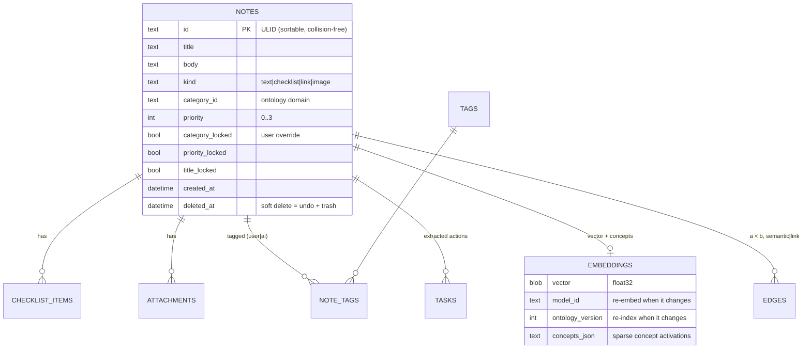
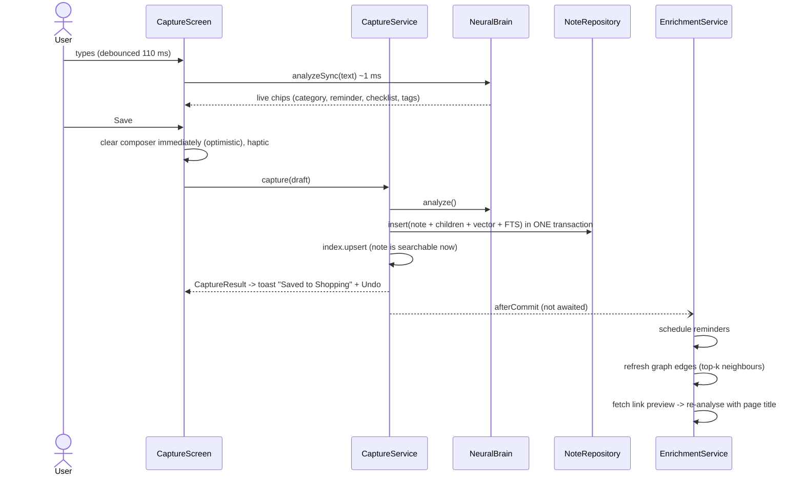

# Architecture

Personal Storage is a **local-first, offline-capable** Flutter app built around one idea:
*capturing a thought must never wait for anything.* Everything else (categorising, tagging,
scheduling, linking) happens after the note is already safe on disk.

## Goals and constraints

| Goal | How it is met |
|---|---|
| Zero-friction capture, minimal latency | The app opens on a focused composer; saving is optimistic (the field clears instantly); one SQLite transaction; AI work is queued *after* commit. |
| Works offline, private by default | SQLite on device, bundled 7.9 MB embedding model, rule-based NLP. No account, no server, no telemetry. |
| Semantic search & auto-organisation | On-device hybrid engine (neural vectors + bilingual concept ontology + FTS5) - see [AI_ENGINE.md](AI_ENGINE.md). |
| Interactive knowledge graph at 60 fps | Barnes-Hut layout on typed arrays, repaint-only animation - see [GRAPH.md](GRAPH.md). |
| Native feel | Cupertino/macOS glass design system - see [DESIGN_SYSTEM.md](DESIGN_SYSTEM.md). |

## Stack (and why)

**Flutter + Dart** (ADR [0001](adr/0001-flutter.md)): one codebase for iOS/Android (plus a web build used
for demos and screenshots), a retained-mode renderer that makes blur, squircles and a custom
60 fps graph canvas straightforward, and Dart's typed arrays for the numerical core.
**drift + SQLite/FTS5** (ADR [0002](adr/0002-local-first-sqlite-drift.md)): typed, reactive, migratable, with
BM25 full-text search in the same file. **Riverpod 3** for dependency injection and reactive UI state.
The "brain" is a **pure-Dart package** (`packages/neural_brain`) with no Flutter or native
dependency, so it runs on mobile, web and the VM, and is tested in isolation.

## Layers

```mermaid
flowchart TB
  subgraph UI["lib/features  (widgets only)"]
    capture["Capture"] --- library["Library + search"] --- graph["Graph"] --- tasks["Tasks"] --- detail["Note detail"] --- settings["Settings"]
  end
  subgraph STATE["lib/app  (Riverpod providers, shell, routing)"]
    providers["providers.dart: AppServices, streams"]
  end
  subgraph SERVICES["lib/services  (use-cases)"]
    cap["CaptureService"] --- enr["EnrichmentService (queue)"] --- srch["SearchService"] --- gsvc["GraphService"]
    rem["Reminders"] --- voice["VoiceService"] --- link["LinkPreviewService"] --- media["MediaStore"]
  end
  subgraph DATA["lib/data"]
    repo["NoteRepository (only SQL)"] --> db[("drift / SQLite + FTS5")]
  end
  subgraph BRAIN["packages/neural_brain  (pure Dart)"]
    nlp["NLP: dates, actions, checklists, entities, priority"]
    onto["Ontology + ConceptMapper"]
    emb["StaticTextEncoder (Model2Vec int8)"]
    idx["SemanticIndex (hybrid search)"]
    gr["Graph: builder, communities, force layout"]
  end
  UI --> STATE --> SERVICES --> DATA
  SERVICES --> BRAIN
```

Rules that keep it clean:

* **Screens never touch SQL or the brain directly** - they call services/providers.
* **`NoteRepository` is the only place that speaks SQL.** Every multi-table write is one transaction,
  and the FTS5 row is rewritten inside it, so the index can never disagree with the notes.
* **`neural_brain` knows nothing about Flutter, SQLite or the UI**; it consumes text and returns
  plain immutable results (`NoteAnalysis`, `SearchHit`, `KnowledgeGraph`).
* **Platform side effects sit behind interfaces** (`Reminders`, `MediaStore`, `VoiceService`,
  `TextEncoder`), which is what makes the flows testable with fakes.

## Data model



* **ULIDs + `updated_at` + soft delete** keep the door open for sync without re-keying.
* **`*_locked` flags** record user decisions, so re-analysis never fights the user.
* `notes_fts` (FTS5, `unicode61 remove_diacritics 2`, prefix 2/3) is keyed by the notes' rowid.

## The capture pipeline: write first, enrich after



If the write fails, the text is put back into the composer; the user's words are never lost.

### Enrichment queue

`EnrichmentService` is a strictly serial queue (SQLite writes never interleave). Jobs are **idempotent
and best-effort**: a failure is logged and skipped. On every launch `reindexStale()` finds notes whose
stored vector was produced by another `model_id` or `ontology_version` and recomputes them in small
batches (yielding to the UI every 20 notes) - this is also the migration path when the user switches
to a cloud encoder or the ontology grows.

## Performance budget

Measured on the Dart VM in a 2-vCPU sandbox (JIT, so a phone running AOT code should do as well or better):

| Operation | Measured |
|---|---|
| Encode one sentence (static model) | 27-37 µs |
| Full analysis of a note (language, entities, dates, tasks, priority, concepts, tags) | ~1.0 ms |
| `capture()` incl. analysis, transaction, FTS, index (in-memory DB) | ~10 ms |
| Search across 5,000 notes (vectors + concepts + lexical) | 3-4 ms |
| Force-layout tick, 1,000 nodes / 2,000 edges | ~1.1 ms (frame budget 16 ms) |
| Cold start of the brain (decode 7.9 MB model, index, 67 concept centroids) | ~40 ms warm, ~160 ms first run |

Search is an exact brute-force scan on purpose: at personal-library sizes it is faster and simpler than
an approximate index and gives exact results. For 100k+ notes the vectors would move to an isolate
or an ANN structure; the `SemanticIndex` API would not change.

## Error handling and resilience

* Optimistic UI with rollback of the composer text on failure.
* Soft delete + 30-day trash + "Undo" toasts; `purgeDeletedBefore` runs at start-up.
* Enrichment failures are isolated per job; search degrades gracefully (FTS-only hits are still
  returned for notes the index doesn't know yet).
* Network features (link previews, cloud embeddings) are opt-in/disable-able and fail silently offline.
* Speech and notification plugins are wrapped: a device without a speech engine shows a message
  instead of crashing (covered by a test).

## Testing

| Layer | What is tested | Count |
|---|---|---|
| `neural_brain` | text utils, tokenizer/stemmer, EN/IT date parser, actions, checklists, entities, priority, ontology integrity, **token-id parity with the Python reference**, hybrid search, graph, force layout, performance guards | 147 |
| App services | real SQLite + FTS5 + real model: capture, edit, re-analysis, search, links, migration, export | 29 |
| App UI | widget flows on the real app tree (capture -> chips -> save -> undo, search, tasks, detail, settings, deep links incl. cold start), graph controller + painter, design system incl. large text | 44 |

`tool/web_shots.py` drives the web build in headless Chromium through the same flows (by accessibility
label) and produces the screenshots in this repository.

Tests found real bugs during development - a layout overflow in the recent-captures strip, a button
that overflowed with large text, `ref` used in `dispose()`, relative dates resolved against a
back-dated timestamp - each is now covered.

## Extending

* **New concept / vocabulary**: add a line to `default_ontology.dart` and bump `defaultOntologyVersion`;
  stored notes are re-indexed automatically.
* **Different embedding model**: implement `TextEncoder` (sync or async), register its calibration in
  `Calibration.forEncoder`; vectors are re-computed because `model_id` changes.
* **Sync**: IDs, timestamps and tombstones are already sync-shaped; a CRDT/last-write-wins layer can be
  added in `NoteRepository` without touching screens.

## Known limitations

* The bundled embedding model is English-centric; Italian is handled mainly by the ontology and
  lexical layers (cross-language concept matching works, purely neural similarity across languages is weak).
* The UI is English-only (the brain is EN/IT); localisation is a straightforward next step.
* Not verified on real devices: see the status table in the [README](../README.md#verification-status).
